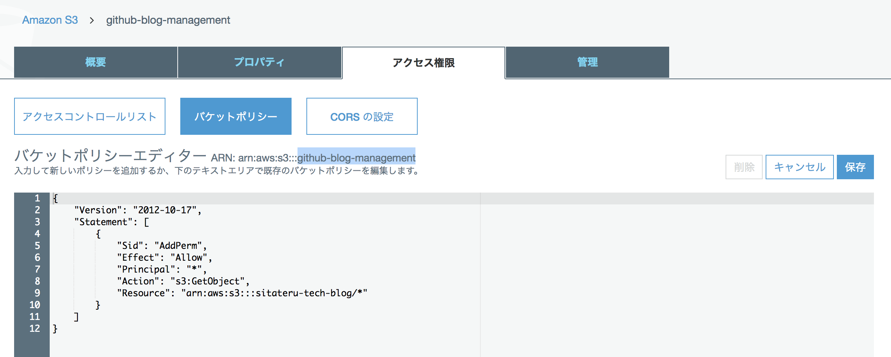
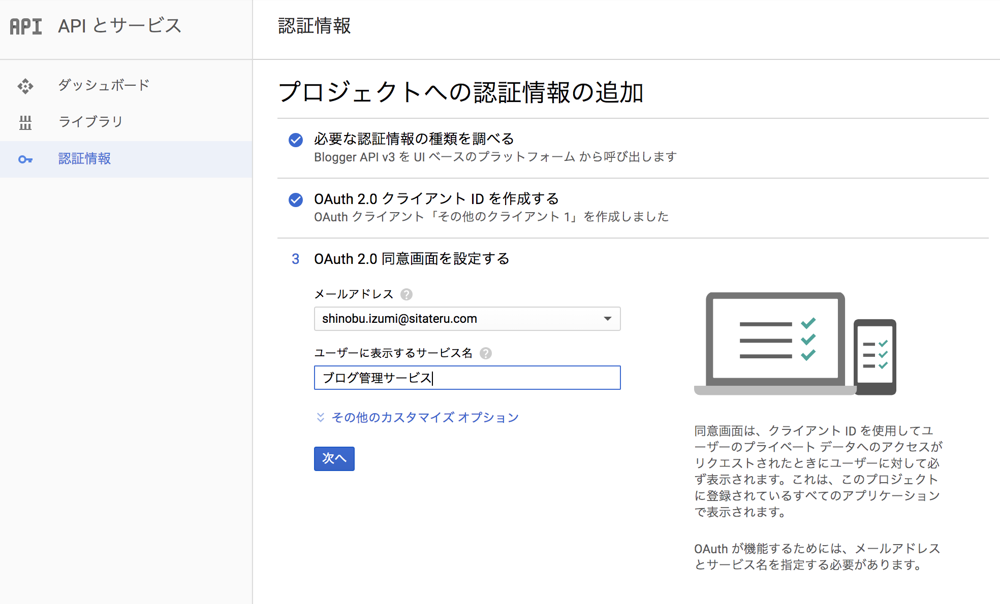

# このリポジトリについて
ブログの管理と投稿を自動化することを目的にしたものです。

マークダウン形式で記述したブログ内容をGitHub上でレビューして、
外部ブログシステムに公開します。

現時点ではBloggerのみを対象としています。
また、画像やファイル類はAWS S3でホスティングすることを想定しています。

# リポジトリをクローン
```
git clone https://github.com/shinobushiva/blogautomation
```

# AWS S3 に APIアクセスするための設定

## S3バケットを作成

AWSのS3コンソールでを開く


バケットの作成

作成をクリック

作成されたバケットを開く


バケットポリシーを設定


バケットポリシー
```
{
    "Version": "2012-10-17",
    "Statement": [
        {
            "Sid": "AddPerm",
            "Effect": "Allow",
            "Principal": "*",
            "Action": "s3:GetObject",
            "Resource": "arn:aws:s3:::github-blog-management/*"
        }
    ]
}
```

## IAMユーザの作成
AWSのIAMコンソールを開きます


ユーザーを追加

プログラムによるアクセスを選択


AmazonS3FullAccessを付与


アクセスキーIDとシークレットアクセスキーを取得して`keys/aws_key.json`に保存して下さい。
```
{
  "accessKeyId": "",
  "secretAccessKey": ""
}
```


# Blogger APIを利用するための設定

Google Cloud Platformを開きます
https://console.cloud.google.com/home/dashboard


プロジェクトの選択 > 新しいプロジェクト


作成したプロジェクトを選択


APIとサービス > ライブラリ


Blogger APIを有効化


選択した次のページで「有効化」をクリックします

認証情報を開いて「認証情報を作成」をクリック


「必要な認証情報」をクリック


次のように選択して、ダウンロードで証明データを取得




ダウンロードした証明書データを
`keys/client_secret.json`
として保存してください。

# .envファイルを設定

S3のバケットの情報を設定してください
```
S3_BUCKET_REGION="ap-northeast-1"
S3_BUCKET_NAME="github-blog-management"
```

# ブログをポスト
```
npm run post
```
を実行すると、posts配下に設置されたブログエントリが投稿されます。

# OAuth credentialの取得
```
npm run oauth
```
`.credentials/googleapi.json` にクレデンシャルが保存されます

# CIRCLE CI

環境変数の設定が必要です。

## ローカルで試す場合
```
circleci build \
--env S3_BUCKET_REGION=*** \
--env S3_BUCKET_NAME=*** \
--env AWS_ACCESS_KEY_ID=*** \
--env AWS_SECRET_ACCESS_KEY=*** \
--env GOOGLE_CLIENT_ID=*** \
--env GOOGLE_PROJECT_ID=*** \
--env GOOGLE_CLIENT_SECRET=*** \
--env GOOGLE_API_CREDENTIAL=***

```
GOOGLE_API_CREDENTIAL には .credentials/googleapi.json の内容全てを設定します。


## 本番実行

CircleCIで設定します。

